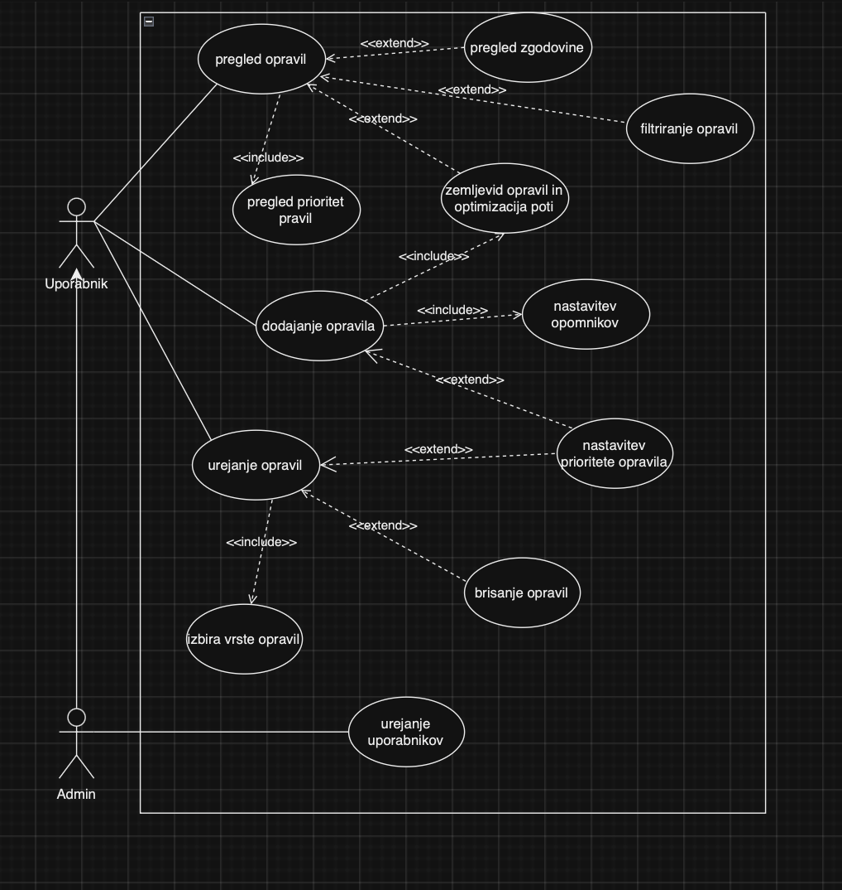

  To-Do App

To-Do aplikacija je zasnovana za učinkovito upravljanje nalog in obveznosti, ki omogoča prijavo uporabnikov, ustvarjanje, urejanje, brisanje nalog ter pregledovanje vseh obstoječih nalog z informacijami o rokih. Aplikacija cilja na izboljšanje produktivnosti in organiziranosti uporabnikov.

   Vizija

Naša vizija za To-Do aplikacijo je ponuditi mladim in odraslim uporabnikom rešitev, ki jim bo pomagala pri učinkovitem obvladovanju vsakodnevnih obveznosti ter doseganju večje organiziranosti in produktivnosti. Aplikacija bo uporabnikom omogočila enostavno načrtovanje in upravljanje šolskih, službenih in domačih obveznosti na enem mestu, pri čemer bodo obveščeni o prihajajočih rokih in odgovornostih. S tem želimo zmanjšati stres, povezan z usklajevanjem številnih nalog, in uporabnikom omogočiti, da se osredotočijo na pomembnejše cilje, pri čemer jim bodo sprotni opomniki in preglednost omogočili pravočasno opravljanje vseh aktivnosti. Za svoje odgovornosti bodo uporabniki lahko uredili datum in uro, prav tako podali kratki opis, kaj bo potrebno postoriti. Prav tako bo možno nastaviti opomnik, ki bo uporabnika obvestil o bližanju roka obveznosti.

   Struktura projekta

    1. Backend (Java Spring Boot)
- Kontrolerji:
  - TaskController: Upravljanje nalog (ustvarjanje, brisanje, posodobitev).
  - UserController: Upravljanje uporabnikov (prijava, ustvarjanje).
  - ResponsibilityController: Upravljanje vrst odgovornosti za naloge.
- Repositoryji (Repositories):
  - TaskRepository, UserRepository, ResponsibilityRepository: Uporaba Spring Data JPA za interakcijo z bazo podatkov.
- Entitete:
  - Task, User, Responsibility: Reprezentacija nalog, uporabnikov in njihovih vrst odgovornosti.
- Viri:
  - application.properties: Konfiguracija aplikacije, vključno z nastavitvami baze podatkov.

 2. Frontend (HTML, CSS, JavaScript)
- HTML in CSS: 
  - index.html: Osnovni uporabniški vmesnik za dodajanje in upravljanje nalog.
  - styles.css: Stilizacija vmesnika.
- JavaScript:
  - server.js: Proxy strežnik za komunikacijo z backendom, omogoča posredovanje zahtevkov z Node.js Express in Axios.
  - Glavni funkcionalnosti vključujejo prijavo uporabnikov, dodajanje in urejanje nalog ter brisanje nalog.

Navodila za namestitev

Zahteve
- Java 17: Potreben za zagon Spring Boot strežnika.
- Maven: Gradbeni sistem za upravljanje odvisnosti.
- Node.js v20.14.0: Za zagon frontend proxy strežnika.

Koraki za namestitev

1. Klonirajte repozitorij
   bash
   git clone https://github.com/JCvkl1/ToDoApp.git
   cd ToDoApp

2. Nastavite podatkovno bazo
   - Preverite konfiguracijo baze podatkov v application.properties, ki se nahaja v	src/main/resources/.
   - Baza podatkov mora biti konfigurirana za uporabo MySQL verzije 8.4. Poskrbite, da je MySQL strežnik aktiven 	in da je baza pravilno konfigurirana.

3. Zagon backend strežnika
   mvn spring-boot:run
   Backend bo tekel na http://localhost:8080

4. Zagon frontend proxy strežnika
   - Premaknite se v mapo "frontend".
   bash
   cd frontend
   npm install
   node server.js
   - Frontend proxy strežnik bo tekel na http://localhost:3000.

5. Dostop do aplikacije
   - Odprite brskalnik in obiščite http://localhost:3000 za uporabo aplikacije.

Navodila za razvijalce

Prispevanje

1. Forkanje repozitorija in ustvaritev nove veje za svoje spremembe.
2. Upoštevajte spodnje standarde kodiranja.
3. Po končanih spremembah ustvarite PULL Request.

Standardi Kodiranja

1. Java (Backend)
   - Uporabite MVC (Model-View-Controller) arhitekturo.
   - Vzdržujte čisto in modularno kodo v ločenih slojih (Controllers, Services, Repositories).
   - Dokumentirajte metode in API endpoint-e za boljšo berljivost.

2. JavaScript (Frontend) 
   - Uporabite Axios za vse HTTP klice k backend API-ju.
   - Pisanje funkcij za ponovno uporabo in modularnost.
   - Proxy strežnik (server.js) omogoča komunikacijo s Spring Boot API-jem.

Orodja in frameworki

1.   Backend
   - Java Spring Boot 2.x
   - Spring Data JPA za ORM in dostop do podatkov.

2.   Frontend
   - HTML, CSS, JavaScript
   - Axios za enostavno izvajanje HTTP zahtevkov.
   - Express.js za proxy strežnik.

3.   Podatkovna baza
   - MySQL (Konfiguracija v application.properties datoteki).

Besednjak

 Uporabnik: Oseba, ki uporablja aplikacijo za dodajanje, urejanje, pregled in brisanje nalog. Uporabniki se lahko prijavijo in upravljajo svoje naloge.

 Naloga: Glavna enota v aplikaciji, ki predstavlja opravilo ali obveznost, ki jo mora uporabnik izvesti. Vsaka naloga lahko vsebuje ime, opis, rok (datum in čas) ter vrsto odgovornosti.

 Opis naloge: Dodatne informacije o nalogi, ki uporabniku omogočajo boljše razumevanje, kaj mora biti opravljeno.

 Rok naloge: Datum in čas, do katerega naj bi bila naloga izvedena. Rok se uporablja tudi za generiranje opomnikov.

 Odgovornost: Kategorija, ki označuje vrsto naloge, kot na primer "Šola", "Služba" ali "Domače opravilo". Omogoča uporabniku, da organizira naloge po različnih področjih življenja.

 Opomnik: Funkcionalnost, ki opozori uporabnika na bližajoč se rok naloge. Opomniki pomagajo uporabniku, da pravočasno izvede svoje naloge.

 Prijava: Proces, kjer se uporabnik identificira in pridobi dostop do svojih nalog v aplikaciji. Prijava zahteva uporabniško ime (e-mail) in geslo.

 

Dodajanje opravila: Uporabnik lahko doda novo opravilo v aplikacijo. Ta funkcionalnost vključuje možnost nastavitve opomnikov za opravila.
- Pregled opravil: Uporabnik lahko pregleda vsa ustvarjena opravila, vključno s pregledom zgodovine opravljenih nalog.
- Urejanje opravil: Uporabnik lahko ureja obstoječa opravila, kar vključuje dodatne funkcionalnosti, kot so filtriranje in brisanje opravil.
- Prijava: Uporabnik se mora prijaviti, da lahko dostopa do aplikacije.
- Pregled vsebine (Admin): Skrbnik (Admin) lahko pregleda vsebino, kar mu omogoča vpogled v celoten seznam opravil vseh uporabnikov.

1. Uporabnik
  Vloga in namen:
  Glavni razred, ki predstavlja uporabnika sistema. Vsak uporabnik ima osnovne podatke, kot so e-poštni naslov, geslo, ime in opombe.
  Ključne metode:
  login(email: String, geslo: String): Boolean
  Omogoča prijavo uporabnika v sistem z uporabo e-pošte in gesla.
  editProfile(details: Uporabnik): void
  Omogoča uporabniku urejanje osebnih podatkov.
  editTask(details: Opravilo): void
  Omogoča urejanje posameznih opravil, ki jih ima uporabnik.
2. Admin (Podrazred Uporabnika)
  Vloga in namen:
  Posebna vrsta uporabnika z dodatnimi privilegiji, kot je upravljanje drugih uporabnikov in pregled vseh opravil v sistemu.
  Ključne metode:
  manageUsers(users: List<Uporabnik>): void
  Omogoča dodajanje, urejanje ali brisanje uporabnikov.
  viewAllTasks(): List<Opravilo>
  Omogoča pregled vseh opravil v sistemu.
3. Opravilo
  Vloga in namen:
  Predstavlja posamezno opravilo, ki ga uporabnik lahko ustvari in upravlja. Vsebuje podatke, kot so naslov, opis, datum, prioriteta, status in odgovornost.
  Ključne metode:
  setReminder(datum: Date): void
  Nastavi opomnik za določeno opravilo.
  updateStatus(status: StatusOpravila): void
  Posodobi status opravila (npr. "NI OPRAVLJEN" ali "OPRAVLJEN").
  editTask(details: Task): void
  Omogoča urejanje podrobnosti opravila.
4. Odgovornost
  Vloga in namen:
  Predstavlja odgovornost, povezano z opravilom. Vsaka odgovornost ima ime (npr. "Šola", "Služba", "Dom").
  Ključne metode:
  editOdgovornost(details: Odgovornost): void
  Omogoča urejanje odgovornosti.
5. Lokacija
  Vloga in namen:
  Predstavlja lokacijo, kjer se opravlja določeno opravilo. Vsebuje podatke, kot so ime lokacije, koordinate in seznam opravil, povezanih z lokacijo.
  Ključne metode:
  getLocationDetails(): String
  Vrne podrobnosti o lokaciji.
  pridobiOpravilaZaDan(datum: Date): List<Opravilo>
  Pridobi vsa opravila, povezana z lokacijo, za določen datum.
  dodajOpraviloNaLokacijo(opravilo: Opravilo): void
  Dodaja opravila na določeno lokacijo.
6. Opozorilo
  Vloga in namen:
  Predstavlja obvestila ali opozorila, povezana z opravilom.
  Ključne metode:
  posljiOpozorilo(opravilo: Opravilo): void
  Pošlje opozorilo uporabniku, povezano z določenim opravilom.
7. <enum> StatusOpravila
  Vloga in namen:
  Enum, ki določa status opravila. Možni statusi so "NI OPRAVLJEN" in "OPRAVLJEN".
8. <enum> PrioritetniNivo
  Vloga in namen:
  Enum, ki določa prioriteto opravila. Možnosti so "NIZEK", "SREDNJI" in "VISOK".
